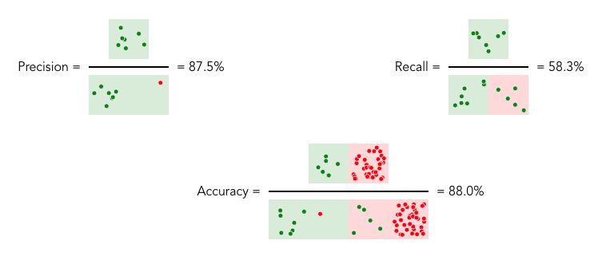

# Which Machine Learning algorithm are you?

A project by [Piotr Migdał](https://p.migdal.pl/) and Katarzyna Kańska. Work in progress. We learn Vue, so any feedback and code is appreciated.



Inspirations:

* [Teaching Machine Learning](https://speakerdeck.com/pmigdal/teaching-machine-learning) and my general approach to teaching via exploration, see also:
  - [Quantum Game with Photons](http://quantumgame.io/)
  - [Quantum mechanics for high-school students](http://p.migdal.pl/2016/08/15/quantum-mechanics-for-high-school-students.html)
  - [Starting deep learning hands-on: image classification on CIFAR-10	](https://deepsense.ai/deep-learning-hands-on-image-classification/)
  - [In Browser AI](https://inbrowser.ai)
  - The collaborative list of [Interactive Machine Learning, Deep Learning and Statistics websites](https://p.migdal.pl/interactive-machine-learning-list/)
* [Classifier comparison - scikit](https://scikit-learn.org/stable/auto_examples/classification/plot_classifier_comparison.html)
* Your Draw It series from The New York Times:
  - [You Draw It: What Got Better or Worse During Obama’s Presidency](https://www.nytimes.com/interactive/2017/01/15/us/politics/you-draw-obama-legacy.html)
  - [You Draw It: How Family Income Predicts Children’s College Chances](https://www.nytimes.com/interactive/2015/05/28/upshot/you-draw-it-how-family-income-affects-childrens-college-chances.html)
  - [You Draw It: Just How Bad Is the Drug Overdose Epidemic?](https://www.nytimes.com/interactive/2017/04/14/upshot/drug-overdose-epidemic-you-draw-it.html)
* [TensorFlow playground](https://playground.tensorflow.org/)
* [Precision and recall - Wikipedia](https://en.wikipedia.org/wiki/Precision_and_recall)
  * [This beautiful diagram](https://en.wikipedia.org/wiki/F1_score#/media/File:Precisionrecall.svg) less -
[that diagram](https://en.wikipedia.org/wiki/Binary_classification#/media/File:Binary-classification-labeled.svg)

## How to run it

It's a [Vue.js](https://vuejs.org/) project, so...

###  Project setup
```
npm install
```

####  Compiles and hot-reloads for development
```
npm run serve
```

####  Compiles and minifies for production
```
npm run build
```

#### Run your tests
```
npm run test
```

#### Lints and fixes files
```
npm run lint
```

#### Deploy to GitHub pages

First, install [push-dir](https://www.npmjs.com/package/push-dir). Then:

```
npm run build; push-dir --dir=dist --branch=gh-pages --cleanup
```

See [Deploy Vue to GitHub pages-the easy way!](https://medium.com/@codetheorist/vue-up-your-github-pages-the-right-way-955486220418). You need to set relative paths in `vue.config.js`.

#### Customize configuration
See [Configuration Reference](https://cli.vuejs.org/config/).
